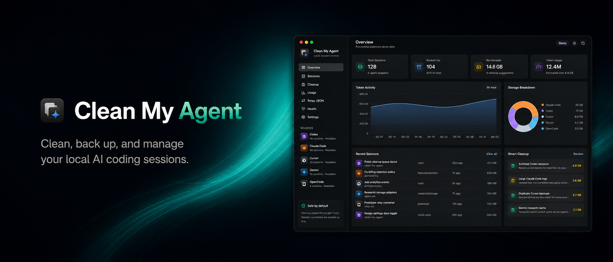

# Clean My Agent

[English](README.md) | [中文](README.zh-CN.md) | [日本語](README.ja.md) | [Français](README.fr.md)



Clean My Agent is a local-first desktop app for cleaning up, backing up, exporting, and understanding AI coding-agent session data.

It scans local sessions from Codex, Claude Code, Cursor, Gemini, and OpenCode, then turns scattered logs into a clear dashboard for storage, token usage, cleanup opportunities, backups, and universal relay exports.

## Download

Install the latest macOS Apple Silicon build with Homebrew:

```sh
brew tap blain3white/clean-my-agent https://github.com/blain3white/clean-my-agent.git
brew install --cask clean-my-agent
```

Update later with:

```sh
brew upgrade --cask clean-my-agent
```

Or download the latest DMG from GitHub Releases:

[Download Clean My Agent for macOS](https://github.com/blain3white/clean-my-agent/releases/latest/download/Clean-My-Agent-mac-arm64.dmg)

Open the downloaded `.dmg`, drag Clean My Agent into Applications, then launch it from Applications.

The current desktop build is unsigned. If macOS Gatekeeper blocks the first launch, open System Settings → Privacy & Security and allow Clean My Agent, or right-click the app and choose Open.

## Why

AI coding agents create a lot of local state: conversations, logs, project metadata, cache files, backups, and tool traces. That data is useful, but it can also become hard to inspect, move, or safely clean.

Clean My Agent gives developers one place to answer:

- Which agents are using the most disk space?
- Which sessions are unusually large or stale?
- What can be cleaned without permanently deleting files?
- Which sessions are backed up?
- How much token activity has accumulated across agents?
- Can a session be exported into a portable relay format?

## Features

- Scan local sessions from Codex, Claude Code, Cursor, Gemini, and OpenCode.
- Show session counts, backup status, reclaimable space, token usage, and storage breakdowns.
- Search and inspect sessions across supported agents.
- Back up individual sessions before risky cleanup actions.
- Export sessions as Markdown, JSON, or universal relay JSON.
- Detect old sessions, backed-up sessions, large logs, and duplicate backups.
- Move cleanup candidates to app-managed Trash instead of permanent deletion.
- Restore items from Trash.
- Keep credential-like files out of scans by default.
- Switch the app interface between English, Chinese, Japanese, and French.
- Support light and dark themes for the dashboard.

## Safety Model

Clean My Agent is designed to be safe by default.

- It reads local agent data before writing anything.
- Cleanup suggestions are generated first and require explicit action.
- Unbacked cleanup candidates are backed up before being moved.
- Deleted files move to Clean My Agent Trash and can be restored.
- Tokens, API keys, OAuth data, `.env` files, and credential-like files are ignored by the scanner.
- Cleanup, backup, export, and Trash behavior are covered by a functional smoke test.

## Supported Sources

| Source      | Status                               |
| ----------- | ------------------------------------ |
| Codex       | Scan, usage, backup, export, cleanup |
| Claude Code | Scan, usage, backup, export, cleanup |
| Cursor      | Scan, usage, backup, export, cleanup |
| Gemini      | Scan, usage, backup, export, cleanup |
| OpenCode    | Scan, usage, backup, export, cleanup |

## Universal Relay JSON

The relay export uses a stable intermediate schema:

```json
{
  "schema": "clean-my-agent.universal-session.v1",
  "source": "codex",
  "session": {},
  "messages": [],
  "files": [],
  "commands": [],
  "git": {},
  "attachments": [],
  "warnings": []
}
```

This format is intended to make agent session data easier to archive, inspect, and eventually convert between agent-specific formats without coupling the UI to each agent's internal storage layout.

## Tech Stack

- Electron
- React
- TypeScript
- Vite / electron-vite
- Tailwind CSS
- Radix / shadcn-style UI primitives
- Node.js 22.13 or newer for development
- Electron 42 with Node.js 24.x at desktop runtime
- Node built-in SQLite
- pnpm

## Development

Requirements:

- Node.js 22.13.0 or newer
- pnpm 10 or newer

Install dependencies:

```bash
pnpm install
```

Start the desktop app:

```bash
pnpm dev
```

Start the renderer-only dev server:

```bash
pnpm dev:renderer
```

Build:

```bash
pnpm build
```

Build a macOS Apple Silicon DMG:

```bash
pnpm dist:mac
```

Lint:

```bash
pnpm lint
```

Run the functional smoke test:

```bash
pnpm verify:functions
```

The smoke test creates temporary fake agent session data and verifies scanning, token statistics, backup, Markdown/JSON export, universal relay JSON export, cleanup to Trash, and Trash restore.

Run the full local CI gate:

```bash
pnpm check
```

Contributions usually branch from `develop` and open pull requests back into `develop`. See [CONTRIBUTING.md](CONTRIBUTING.md) for setup, style, testing, safety, and pull request guidance. Maintainer-side branch protection recommendations live in [docs/maintainer-guide.md](docs/maintainer-guide.md).

## Project Map

- `electron/main.ts`: Electron window setup and IPC registration.
- `electron/preload.ts`: renderer-safe API bridge.
- `electron/lib/`: scanning adapters, filesystem helpers, database, and app service logic.
- `src/App.tsx`: main dashboard UI and views.
- `src/components/ui/`: shared UI primitives.
- `src/hooks/`: renderer state and theme hooks.
- `src/shared/types.ts`: cross-process types and shared contracts.
- `scripts/verify-functions.ts`: functional smoke test with fake local session data.

## Roadmap

- Add richer session detail views.
- Expand agent-specific storage adapters as formats evolve.
- Add more relay converters on top of the universal JSON schema.
- Improve cleanup policy controls for teams with different retention preferences.
- Add signed and notarized desktop builds for smoother first launch.

## Status

This is an early open-source version. The app is usable for local scanning, statistics, backup, export, cleanup suggestions, Trash, and universal relay JSON export. Agent-specific import and continue-session workflows are intentionally not finalized yet.

## License

MIT
